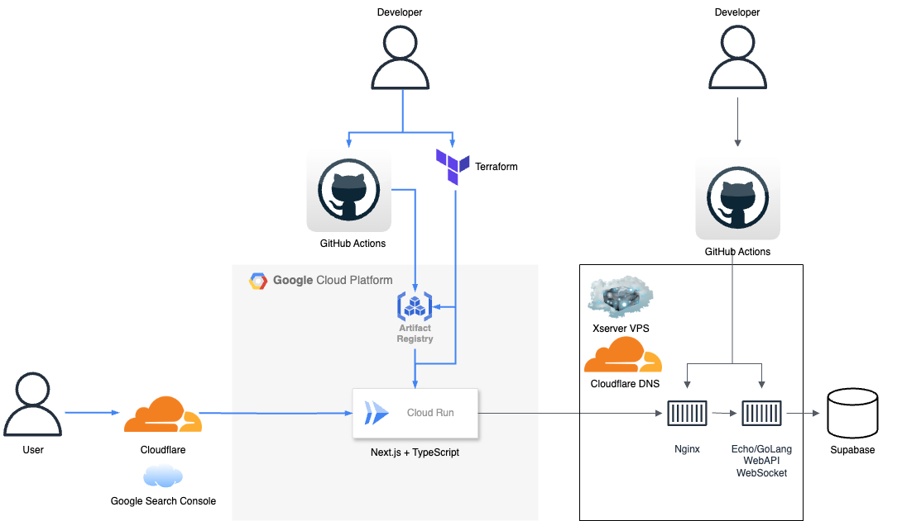

# チャットWeb簡易アプリケーション(バックエンド側)

## Summary

チャットWeb簡易アプリケーションのバックエンドです。

## Site

以下URLで公開しています。

[TODO]

## Tech Stack

## Architecture

## Frontend Repository

[Frontend Repositoryはこちら](https://github.com/kojikawazu/nextjs-echo-chat-web-app)
